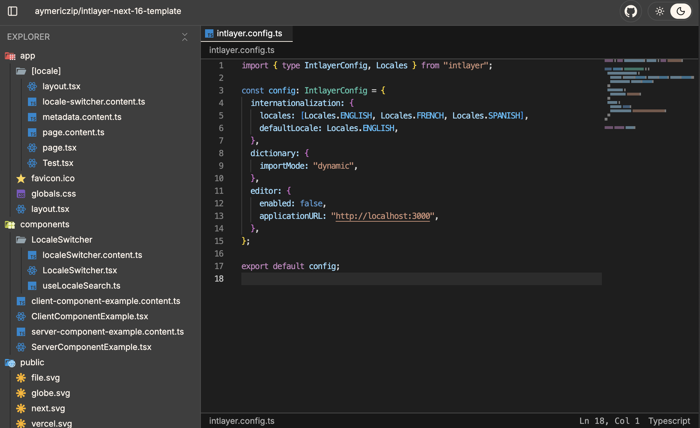

# IDE

A high-performance web-based IDE designed to render and browse public repository code directly in your browser.



## Features

- **Monaco Editor**: Industry-standard code editing experience.
- **Syntax Highlighting**: Beautiful code rendering powered by [Shiki](https://shiki.style/).
- **Flexible Layout**: Multi-tab interface and resizable panels powered by [Dockview](https://dockview.dev/).
- **File Exploration**: Browse repository structures with familiar Material Icon Theme.
- **Public & Private Repos**: Instantly load and view any public repository. Support for private repositories via GitHub tokens.
- **Modern Stack**: Built with React 19, Vite, Tailwind CSS 4, and Jotai.

## GitHub Authentication

To access private repositories, the IDE requires a GitHub Personal Access Token (PAT).

### How to provide the token

- **Automatic Prompt**: If you attempt to access a private repository without a token, the IDE will prompt you to enter one.
- **Persistence**: Once entered, the token is securely stored in your browser's `localStorage` for future sessions.
- **Manual Setting**: You can programmatically set the token by sending a `postMessage` to the IDE iframe:
  ```javascript
  window.postMessage(
    { type: "INTLAYER_SET_TOKEN", token: "your_github_token" },
    "*",
  );
  ```

The token handling logic is implemented in `src/repo-api.ts`.

## Origin

This project is a fork of [1qh/idecn](https://github.com/1qh/idecn).

## Getting Started

### Prerequisites

You need [Bun](https://bun.sh/) installed on your machine.

### Installation

```bash
bun install
```

### Development

Run the development server:

```bash
bun run dev
```

### Building for Production

```bash
bun run build
```

The production-ready assets will be in the `dist` directory.

## Deployment

### Docker

You can run the IDE using Docker:

```bash
docker build -t ide .
docker run -p 3000:3000 ide
```

## Technologies

- **Framework**: React 19
- **Build Tool**: Vite
- **Styling**: Tailwind CSS 4
- **Editor**: Monaco Editor
- **State Management**: Jotai
- **Icons**: Lucide React & Material Icon Theme
